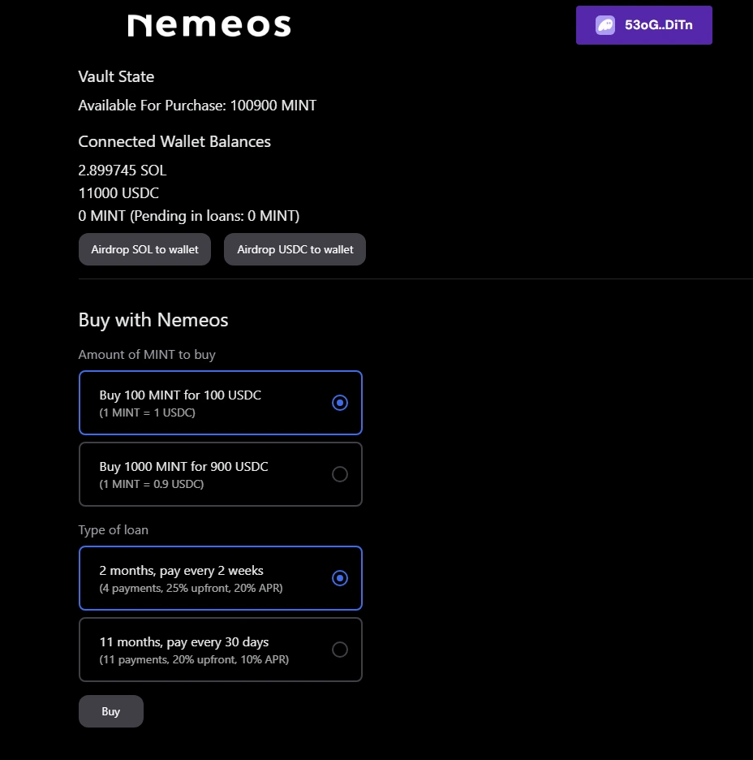

# Nemeos Solana Token Financing

This project has been built from scratch for our participation in the [Solana Colosseum Radar Hackathon](https://www.colosseum.org/radar).

Colosseum Hackathon Project Page: https://arena.colosseum.org/projects/hackathon/nemeos

Learn more about Nemeos at [nemeos.finance](https://nemeos.finance)  
Join our Discord community 👉 [discord.gg/MfWtspNeMz](https://discord.gg/MfWtspNeMz)

## Description

**Nemeos Solana Token Financing** is a decentralized Initial Coin Offering (ICO) financing solution developed on the Solana blockchain. This platform facilitates a seamless interaction between project owners and investors, ensuring a fair and efficient token financing process.

### How It Works

For project owners like Alice, who wish to launch a new token called **MINT**, the process begins with depositing her tokens into a Nemeos vault within the financing protocol. This vault serves as a secure reserve of tokens available for purchase, functioning similarly to a traditional bank's reserve.

Investors, such as Bob, can participate in the ICO by purchasing MINT tokens through a structured loan agreement. Bob initiates his investment by paying 20% of the token's value in USDC upfront, which entitles him to receive 20% of the total MINT tokens immediately. The remaining 80% of the token purchase is financed through a loan that Bob agrees to repay in several installments over a specified period. This loan comes with an annual interest rate and associated protocol fees. It is crucial for Bob to adhere to the repayment schedule, ensuring that all installments are paid before their due dates.

In the event that Bob fails to repay the loan as agreed, the remaining MINT tokens tied to his loan are automatically released back to Alice. Alice then has the discretion to either redeposit these tokens into the Nemeos vault or utilize them according to her project’s needs.

### Benefits

For project owners, Nemeos provides a secure method to finance their projects without the necessity of selling tokens at a discounted rate. This approach allows Alice to maintain greater control over her token distribution and project valuation, fostering a more stable and trustworthy investment environment.

Investors benefit from the ability to participate in ICOs without the requirement of paying the full investment amount upfront. By locking in the purchase price of the tokens, Bob is protected against market volatility during the loan period, ensuring that the value of his investment remains stable.

Furthermore, the Nemeos protocol operates in a decentralized and trustless manner, enhancing the overall security and reliability of the financing process. This decentralization contributes to market stability by mitigating extreme price fluctuations, thereby protecting both project owners and investors.

## Important Notice

This project is a prototype and is **not production-ready**. It has not been audited and should not be used in a production environment. **Using this project in a production environment could lead to loss of funds.**

## Try on Devnet

⭐ You can try the dapp on Solana Devnet at [solana-hackathon.nemeos.finance](https://solana-hackathon.nemeos.finance)

To start a loan, you need some USDC. Connect your Solana wallet and click on "Airdrop USDC to wallet" to receive some.

In the Devnet deployment, we remove some checks from the Solana program to allow for easier testing. For example, we included the ability to fully pay a loan at any moment, whereas in a production environment, the loan must be paid in installments between pre-defined dates.



---

## Installation

Install Rust, Solana CLI, and Anchor CLI.

See Solana [Installation instructions](https://solana.com/docs/intro/installation).

```bash
$ solana --version
solana-cli 1.18.24 (src:7ba2a0e9; feat:3241752014, client:Agave)

$ anchor --version
anchor-cli 0.30.1
```

## Build project

```bash
anchor build
cp target/idl/solana_token_financing.json app/anchor/solana_token_financing.json
cp target/types/solana_token_financing.ts app/anchor/solana_token_financing.ts
```

## Run tests

You need Solana accounts to run the tests.

Some pre-generated accounts are available in the [`./accounts`](./accounts) folder. Please do not use these accounts in production, the private keys are exposed publicly and could lead to loss of funds.

```bash
solana-keygen new --no-bip39-passphrase --outfile accounts/id.json --force
solana-keygen new --no-bip39-passphrase --outfile accounts/nemeos.json --force
solana-keygen new --no-bip39-passphrase --outfile accounts/usdc.json --force
solana-keygen new --no-bip39-passphrase --outfile accounts/admin.json --force
solana-keygen new --no-bip39-passphrase --outfile accounts/seller.json --force
solana-keygen new --no-bip39-passphrase --outfile accounts/borrower.json --force
solana-keygen new --no-bip39-passphrase --outfile accounts/mint.json --force
```

Then run the tests

```bash
anchor test
```

## Manual tests

Configure Phantom browser extension to connect to Localnet at http://localhost:8899

Import the test wallet with the following mnemonic

```
claw blame sorry warrior true uphold hurt smooth express leopard hope fiction
```

In [`./tests/solana_token_financing.ts`](./tests/solana_token_financing.ts), uncomment the section around this line

```bash
console.log(`*** Waiting 24 hours (keeping cluster open) ***`);
```

Start and initialize a cluster and the program

```bash
anchor test
```

You can now play around with the project, the unit test will fund the test account with SOL and USDC.

### Start a local Solana cluster

```bash
solana-test-validator
```

## Common issues

### DeclaredProgramIdMismatch

If you see the following error

```bash
Error: AnchorError occurred. Error Code: DeclaredProgramIdMismatch. Error Number: 4100. Error Message: The declared program id does not match the actual program id.
```

Run the following command

```bash
anchor keys sync
```

## License

Copyright 2024 Nemeos

Permission is hereby granted to view this code for educational and demonstration purposes only. No permission is granted to use, distribute, modify, or create derivative works based on this code without explicit written permission from the copyright holder.

This code is licensed for reading and educational purposes only. The original author(s) retain full ownership and all rights to the code. Commercial, non-commercial, and any other forms of use, modification, or redistribution are prohibited.

For further permissions, contact us.
